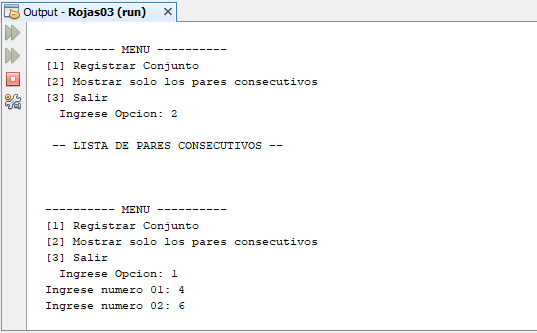

# Conjunto de números
Sistema de conjuntos de números donde registra un conjunto formado por un par de números y muestras los conjuntos con pares consecutivos, **15/11/19**.

<strong>Imagen:</strong> Menú principal - Registrar conjunto.

